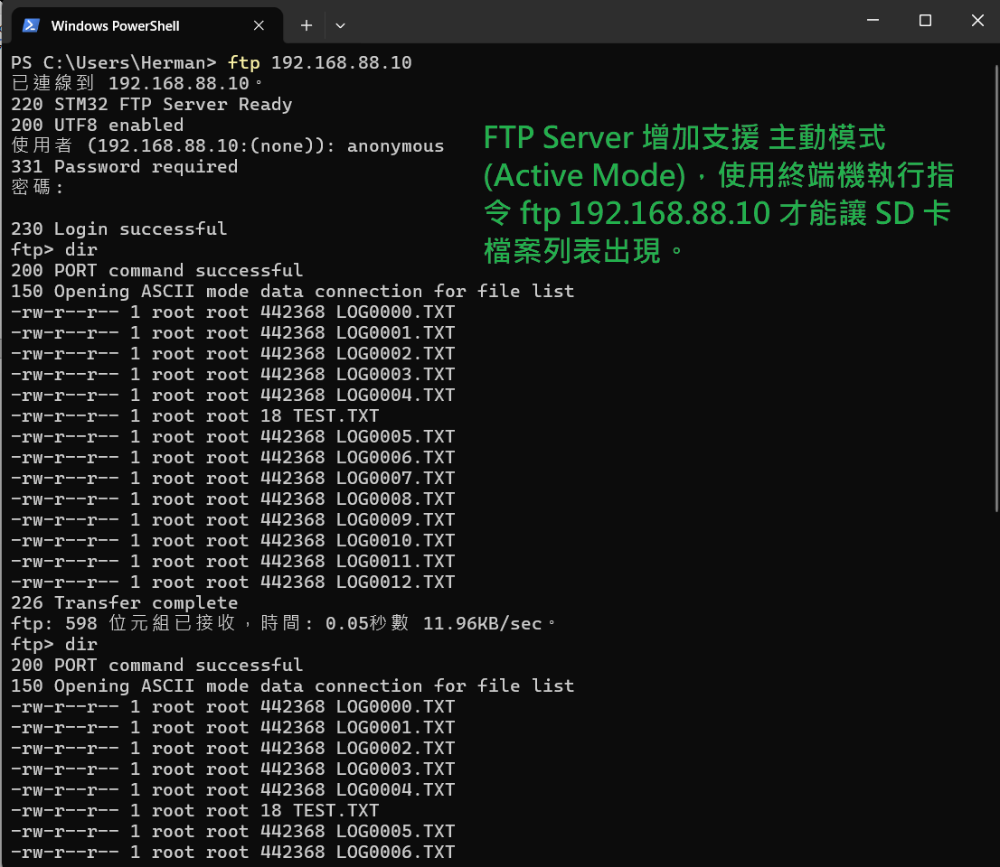
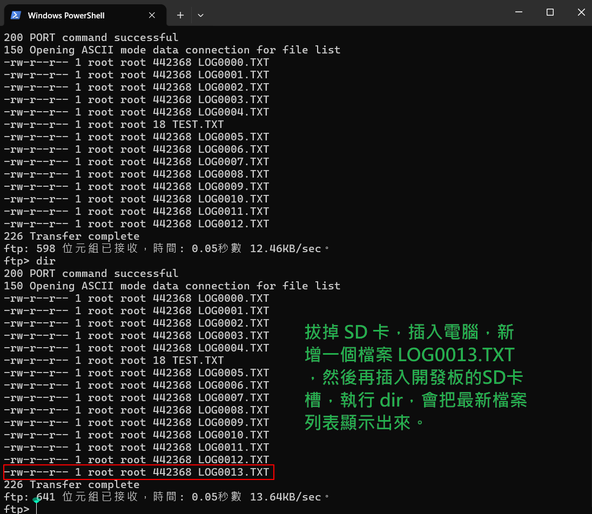
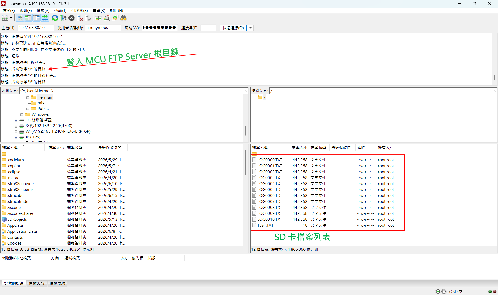
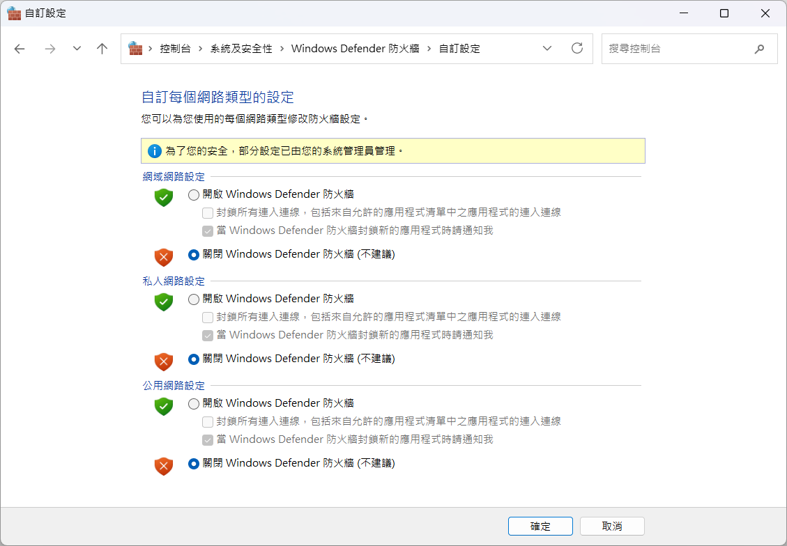
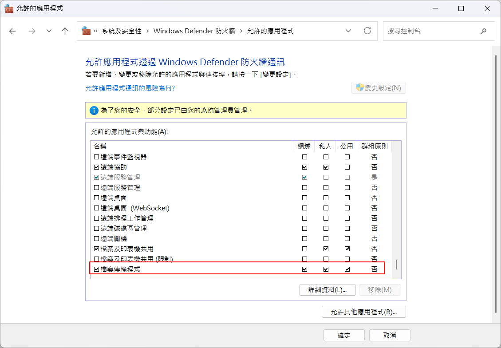

# STM32H755ZI-Q FTP Server + SD 卡 檔案系統 整合

## 開發進度追蹤


### [2026-06-23]
1. 修改點： CM7\Core\Src\main.c ， CM7\Core\Src\cm7_file_index.c 與 CM4\Core\Src\tcp_server.c 。
2. 在檔案 ： CM4\Core\Src\tcp_server.c 卡關很久，關鍵點在 send_dir_list() 內的 

```c
int len = snprintf(
        &dir_data[offset],
        sizeof(dir_data) - offset,
        "-rw-r--r-- 1 root root %lu Jan 01 2026 %s\r\n",
        (unsigned long)fs->files[i].filesize,
        (const char *)fs->files[i].filename);
```

        檔案名稱和顯示 "-rw-r--r-- 1 root root %lu Jan 01 2026 %s\r\n", 是關鍵。
        問題發生在於 ：
        (1) Filezilla 一開始就無法連上線。
        (2) 即使首次可以連上線，第一次顯示的檔案列表是前一次遺留下來的，也就是舊的檔案資料。
        (3) 只有利用 F5 Refresh 刷新才能顯示最新的檔案列表。
        (4) 但會發生 執行 Refresh 就斷線。
3. 今天的版本勉強算是及格，穩定性還有改善空間。有時會無法連上 Filezilla ，按下開發板的 RESET 按鍵後重試。另外，Refresh 不要太快太頻繁的按，會卡住，因為資料傳輸需要時間。
4. 附件圖為 Filezilla client 設定為 主動模式 方式。


### [2026-06-18]
1. Filezilla client 也支援 主動模式 連線 FTP server，使用站台管理員中的傳輸設定，就可以變更為主動模式 (Active Mode) 連線 CM4 FTP Server。 此版本支援 使用 Power shell 執行命令 ftp 192.168.88.10 ftp>dir 也支援 Filezilla client 採用 主動模式 連線 CM4 FTP Server。
2. 目前遭遇 使用 Filezilla client 被動模式 連接 CM4 FTP Server 會失敗，刷新也不行。
3. 可以參考 專案 ： ETH_FTP_260608  已經修正 刷新失敗的問題。


### [2026-06-17]
1. 增加功能 ： 偵測 SD 卡是否存在於開發板的 SD 卡槽內。一旦 SD卡拔除，開發板上的紅色 LED 燈亮。當 SD 卡插入 SD 卡槽，開發板上的綠色 LED 燈亮一秒後熄滅。
2. 完成 支援 FTP Server 主動模式 (Active Mode) 功能，可以透過 終端機 (Power shell) 視窗，執行命令： ftp 192.168.88.10 ->  anonymous -> anonymous 進入到提示符號 ftp> 下。執行 ftp> dir 命令，會將 SD 卡內的檔案列表 顯示出來。
3. 完成 刷新功能。 實驗步驟： ftp> dir 顯示出12個檔案列表。 拔除 SD 卡，插入電腦，增加一個檔案，再把 SD 卡插入 開發板 SD 卡槽，再一次執行 ftp> dir，會看到 新增加的檔案再列表中。
4. 特別注意，使用 FTP 主動模式與電腦 Power Shell 終端機  連接， 要關閉防火牆。 設定方式： 開始 -> 搜尋 控制台 -> 選擇  系統及安全性 -> 選擇 Windows Defender 防火牆 -> 選擇左側 開啟或關閉 Windows Defender 防火牆，然後關閉 所有防火牆。
5. 另外一種方式，防火牆全部開啟狀態下，在 Windows Defender 防火牆 -> 選擇左側 允許應用程式透過 Windows Defender 防火牆通訊 -> 在 允許的應用程式與功能框架下，移動到最後(最底下)，有一個 『檔案傳輸程式』 把 公用 勾選，也勾選 檔案傳輸程式 的 checkbox，按下確定， ftp> dir 就會顯示出檔案列表，在防火牆開啟情況下。

### [2026-06-16]
1. 除了已經建立完成的 PASV 被動模式 (Filezilla client 支援此模式)，再添加 主動模式 (Active Mode)，因為使用 Windows 終端機 輸入 ftp 192.168.88.10 或是 使用 檔案總管 都是採用 主動模式。但必須注意，主動模式是 MCU 主動連接 電腦端，因此，Windows 防火牆必須關閉，或是開放特定 socket 通過，不然 ftp 192.168.88.10 會 停滯 失敗，不會出現檔案列表。

### [2026-06-15]
1. Filezilla client 可以連接 開發板 FTP Server，連上線後，檔案列表會顯示 SD 卡 檔案。
2. 因為讀取根目錄 "/" 會讀到 Raw data 形成的幽靈檔案，導致 正確的 FATFS 檔案數量與實際讀取得到的不同，因此，新增一個資料夾，LOGFILES，把 FATFS 檔案移到此資料夾，CM7 讀取檔案(數量) 也從此資料夾讀取，這樣可以避免掉讀取到 Raw data 問題。
3. 使用 Filezilla 是屬於 PASV 被動式，如果連線後發現檔案列表沒有更新，這是 Filezilla cache 問題，要按下 F5 Refresh，就可以重新讓 Filezilla 呼叫 FTP Server LIST 一次，更新檔案列表。
4. 這個版本因為不支援 主動式，所以，使用 Power shell 執行 ftp 192.168.88.10 -> anonymous -> anonymous -> ftp> dir -> 會卡住。
5. 這個版本有許多 debug 用的 程式，先保留，必要時可以回用，下一版本再刪除。

### [2026-06-11] 
完成 CM4 FTP Server 建置，可以透過 Filezilla Client 連接上。連接輸入 IP ： 192.168.88.10 使用者名稱： anonymous， 密碼 ： test 連接埠： 21 (可以不填) ，按下 快速連線，右側會出現 開發板端的 虛擬(模擬) 檔案列表，有兩個檔案： log.txt 與 test.txt 。 

### [2026-06-10] 
Ethernet 網路建置完成，從電腦端以網路線接到開發板 RJ45， ping 192.168.88.10 成功。 


## 專案簡介

## Ethernet 網路部分

### 本專案使用 STM32H755ZI-Q NUCLEO 開發板 NUCLEO-H755ZI-Q 建立 Ethernet 網路功能，採用：

* STM32H755ZIT6
* Cortex-M4
* LAN8742A PHY
* RMII（Reduced Media Independent Interface）介面
* STM32 HAL Ethernet Driver
* LwIP TCP/IP Stack
* TCP Server using the LwIP Raw API
* FTP Control Channel port ： 21
* FTP Passive Mode (PASV)

## 最終目標：

* 建立穩定 Ethernet 通訊
* Ping 測試成功
* 在 CM4 核心 建立 TCP server 與 FTP Server 

---

```text
FileZilla Client
        │
        ▼
STM32 FTP Server
        │
        ▼
LwIP TCP/IP Stack
        │
        ▼
Ethernet Driver
        │
        ▼
RMII PHY
```

---

# Relationship to the OSI Model

The project gradually covers multiple layers of the OSI network model.

| OSI Layer            | Protocol / Function |
| -------------------- | ------------------- |
| Layer 7 Application  | FTP                 |
| Layer 6 Presentation | FTP Text Commands   |
| Layer 5 Session      | FTP Control Session |
| Layer 4 Transport    | TCP                 |
| Layer 3 Network      | IP / ICMP           |
| Layer 2 Data Link    | Ethernet / ARP      |
| Layer 1 Physical     | RMII PHY            |

---


---

# 開發環境 

MCU： STM32H755ZIT6

開發板： NUCLEO-H755ZI-Q

PHY： LAN8742A

網路堆疊： LwIP

開發工具：

* STM32CubeMX
* STM32CubeIDE

執行核心： Cortex-M4

---

## SD 卡 存取 部分 

## 專案目標： 
* 將 STM32H7 以 Raw Sector 方式高速寫入 SD 卡的資料 
* 重新讀出後，轉換成 Windows 可辨識的 FATFS 檔案。

# 系統設計概念

本系統分成兩個階段：

---

# 第一階段：高速 Raw Data 寫入 SD 卡

目標：

> 不透過 FATFS，
> 直接以 Sector 方式高速寫入 SD 卡。

---

# 第二階段：Raw Data 生成 FATFS 檔案

本專案第二階段：

> 將 SD 卡內 Raw Data 重新讀出，
> 並生成 Windows 可見檔案。

---
## 圖示












